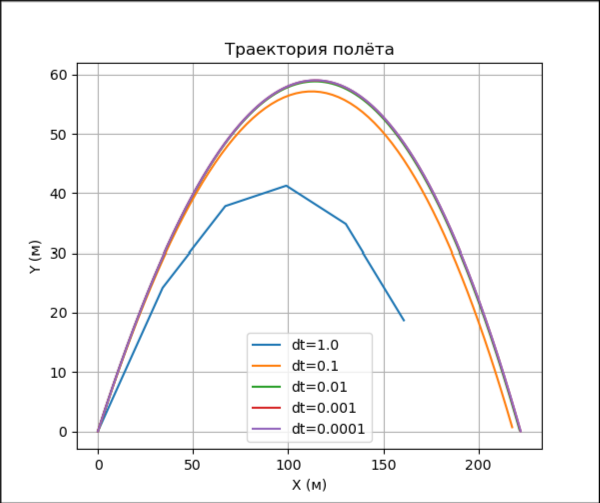

# Лабораторная работа: Моделирование полёта тела в атмосфере

## Параметры модели

- Начальная скорость: 50 м/с  
- Начальный угол: 45°  
- Масса: 1 кг  
- Радиус тела: 0.05 м  
- Плотность воздуха: 1.29 кг/м³  
- Коэффициент сопротивления Cd: 0.15

## Траектории

| Шаг моделирования, с | 1 | 0.1 | 0.01 | 0.001 | 0.0001 |
|----------------------|---|-----|------|-------|--------|
| Дальность полёта, м | 190.44  | 220.57    | 221.85     | 222.09      | 222.11       |
| Максимальная высота, м | 41.27 | 57.17 | 58.87 | 59.04 | 59.06 |
| Скорость в конечной точке, м/с | 39.14 | 43.72 | 43.83 | 43.86 | 43.87 |

## Вывод

При шаге 1 с. дальность и максимальная высота сильно занижены: дальность 190.44 м вместо ~222 м, высота 41.27 м вместо ~59 м. С уменьшением шага результаты стабилизируются - уже при шаге 0.01 с. погрешность характеристик полета начинает измеряться в десятых долях.