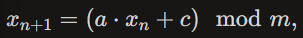

### Базовый датчик случайных чисел

### **LCG (Linear Congruential Generator)**  

Параметры: m=2 ** 31, a=1103515245, c=12345.

### **Встроенный метод python**
random.random()

### Результаты
| Generator            | Sample Mean | Mean Diff       | Sample Variance | Theoretical Variance | Variance Diff     |
|----------------------|------------|-----------------|-----------------|----------------------|-------------------|
| LCG                  | 0.500523   | +5.234025e-04   | 0.082915        | 0.083333             | -4.182298e-04     |
| python.random        | 0.500062   | +6.225296e-05   | 0.083576        | 0.083333             | +2.429381e-04     |

### Вывод
Оба генератора показывают корректную работу, отклонения от теоретических стастистик имеют порядок не более e-04. При этим нетрудно заметить, что 
кастомный генератор демонстрирует большее отклонение по сравнению со встроенным