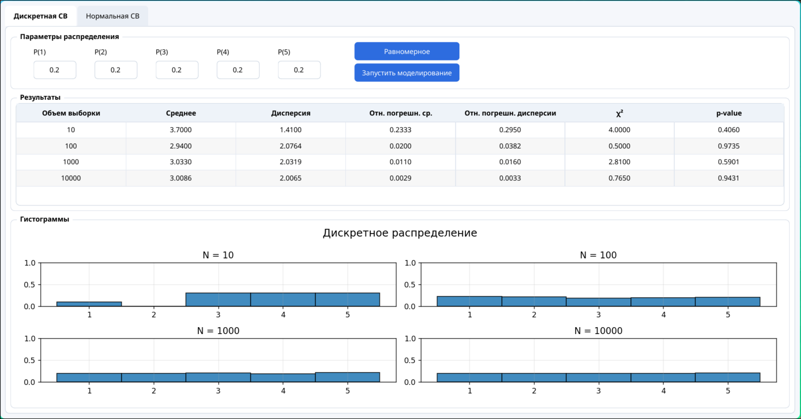
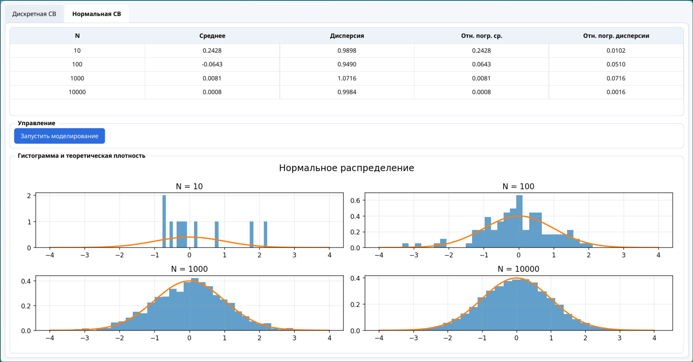

### Имитационное моделирование дискретных случайных величин

**Задание:**
- реализовать генерацию дискретной случайной величины, заданной рядом распределения;
	- вычислить эмпирические вероятности;
	- вычислить выборочные среднее и дисперсию, их относительные погрешности;
	- вычислить статистику χ² и применить критерий χ² при:
	  - N = 10, 100, 1 000, 10 000;
- Реализовать генератор нормальной случайной величины, 
	- построить гистограммы 
	- сравнить точность моделирования при разных объёмах выборки.
- сделать вывод.

## 1. Дискретное равномерное распределение

### **Параметры:**
- Значения X = {1, 2, 3, 4, 5}
- Вероятности Pi = 0.2 для всех i
- Теоретическое среднее 3
- Теоретическая дисперсия: 2

### **Результаты:**

- при маленьком объеме выборки N=10 результаты получаются нестабильными, отклонения от теоретических статистик могут быть как большими, так и вообще могут быть нулевыми
- При увеличении объема выборки (N=100,1000,10000) результаты стабилизируются, эмпирические среднее и дисперсия практически совпадают с теорией.
- Относительные погрешности уменьшаются с ростом объема выборки.
- Критерий χ² показывает согласие распределения выборки с теоретическим. Для больших N p-значение > 0.05. При этом можно заметить, что иногда при N=10000 p-value может опуститься ниже 0.05, тогда как при N=100,1000 такого не происходит. Это показывает, что даже малейшие отклонения от теоретического распределения при большом объеме выборки могут приводить к росту хи квадрат.  
### **Вывод:**
- Моделирование дискретного равномерного распределения корректно.
- Точность растет с увеличением объема выборки.

## 2. Нормальное распределение

### **Параметры:**
- Среднее μ = 0
- стандартное отклонение σ = 1

### **Результаты моделирования:**

- Для выборки N=10 гистограмма получается шумной, не отражает природу нормального распределения.
- Для выборки N=100 гистограмма все еще шумная, но уже можно увидеть нормальность распределения.
- Для N=1000,10000 гистограмма почти полностью совпадает с теоретической кривой плотности.

### **Вывод:**
- Моделирование нормального распределения корректно.
- Точность растет с увеличением объема выборки.
