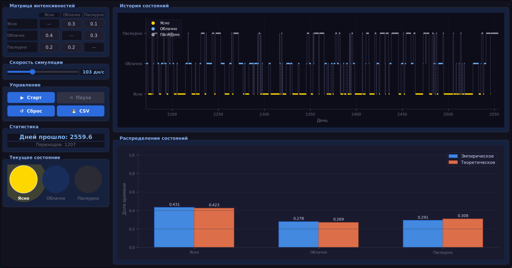

### Марковская модель погоды

**Задание:**
- смоделировать погоду по дням с тремя состояниями: 1 — ясно, 2 — облачно, 3 — пасмурно;
- задать матрицу интенсивностей переходов между состояниями;
- выполнить моделирование в реальном времени с визуализацией текущего состояния;
- сравнить эмпирическое распределение времени пребывания в состояниях с теоретическим стационарным;
- сохранить историю переходов в CSV.

## 1. Модель

Используется **непрерывная цепь Маркова**. Задаётся матрица интенсивностей λᵢⱼ — скорость перехода из состояния i в состояние j. Время пребывания в состоянии i имеет экспоненциальное распределение:

```
t_i ~ Exp(∑_{j≠i} λ_ij)
```

Следующее состояние выбирается с вероятностью:

```
p_ij = λ_ij / ∑_{k≠i} λ_ik
```

### Параметры (матрица интенсивностей λ):

|          | Ясно | Облачно | Пасмурно |
|----------|------|---------|----------|
| Ясно     | —    | 0.3     | 0.1      |
| Облачно  | 0.4  | —       | 0.3      |
| Пасмурно | 0.2  | 0.2     | —        |

Суммарные интенсивности выхода: λ₁=0.4, λ₂=0.7, λ₃=0.4(1/день).  
Среднее время пребывания: 2.5 дня в ясно, 1.4 дня в облачно, 2.5 дня в пасмурно.

### Теоретическое стационарное распределение:

Решается система πQ = 0, Σπ = 1, где Q — матрица генератора:

| Состояние | π          |
|-----------|------------|
| Ясно      | 0.423      |
| Облачно   | 0.269      |
| Пасмурно  | 0.308      |

## 2. Результаты моделирования


## 3. Вывод

- Модель корректно воспроизводит поведение непрерывной цепи Маркова.
- Эмпирическое распределение сходится к теоретическому стационарному с ростом времени симуляции.
- Среднее время пребывания в каждом состоянии соответствует теоретическому
