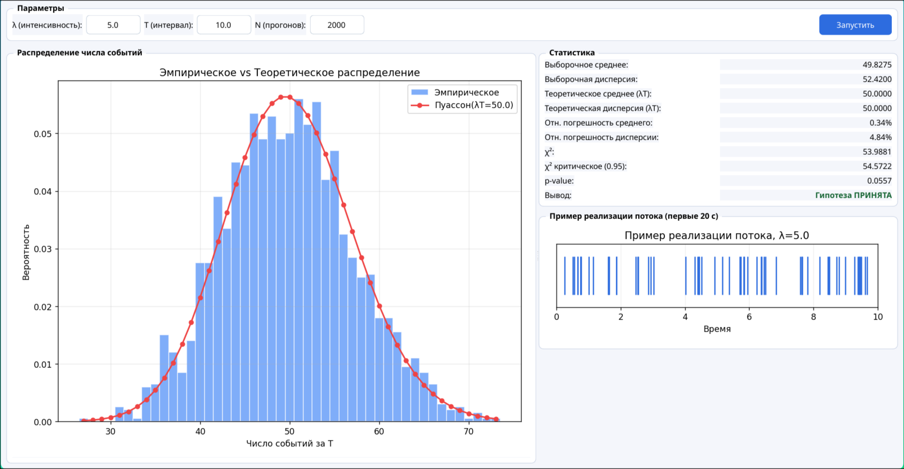

### Пуассоновский поток. События на сервере

**Задание:**
- смоделировать поток заявок на сервер;
- определить число заявок за интервал времени T;
- построить распределение числа заявок и сравнить с теоретическим распределением Пуассона;
- вычислить среднее и дисперсию, применить критерий χ².

## 1. Модель

Пуассоновский поток задаётся интенсивностью λ - числом заявок в единицу времени. Интервалы между событиями независимы и имеют экспоненциальное распределение:

Число событий за интервал T подчиняется закону Пуассона:

```
P(X = k) = (λT)^k * e^(−λT) / k!
```

Теоретические характеристики:
```
M[X] = λT
D[X] = λT
```

## 2. Параметры

- λ = 5.0 (заявок/ед. времени)
- T = 10.0 (единиц времени)
- N = 2000 прогонов
- λT = 50 — теоретическое среднее число заявок

## 3. Результаты



| Характеристика             | Теория | Эмпирика |
|----------------------------|--------|----------|
| Среднее                    | 50.000 |  49.82   |
| Дисперсия                  | 50.000 |  52.42   |
| Отн. погрешность среднего  | —      |  0.34%   |
| Отн. погрешность дисперсии | —      |  4.84%   |

- Гипотеза о пуассоновском распределении принята по критерию хи-квадрат.
- Эмпирическая гистограмма точно совпадает с теоретическими вероятностями Пуассона.


## 4. Вывод

- Моделирование пуассоновского потока через экспоненциальные интервалы корректно воспроизводит теоретическое распределение.
- Эмпирические среднее и дисперсия совпадают и близки к теоретическому значению λT, что подтверждает свойство пуассоновского распределения.
- Критерий χ² подтверждает гипотезу о пуассоновском характере потока.
