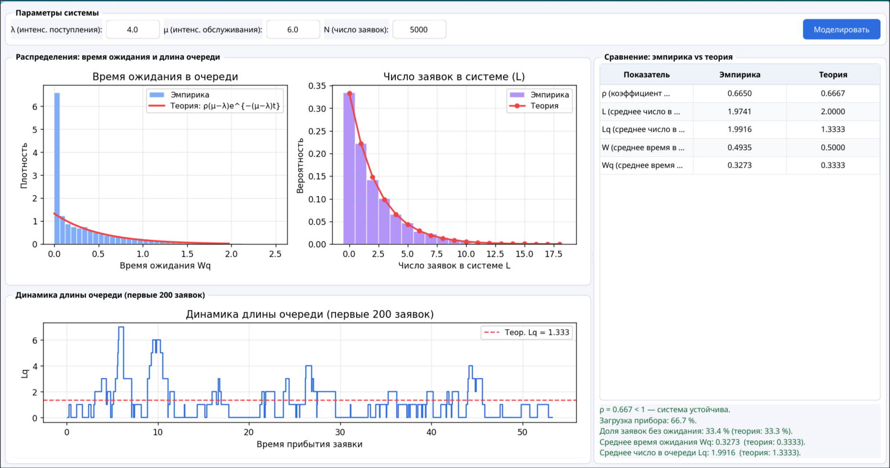

### Система массового обслуживания M/M/1

**Задание:**
- смоделировать простейшую одноканальную систему массового обслуживания M/M/1;
- задать интенсивность поступления заявок λ и интенсивность обслуживания μ;
- вычислить основные характеристики системы эмпирически и сравнить с теоретическими формулами;
- построить распределение времени ожидания и длины очереди.

## 1. Модель

Система **M/M/1** — одноканальная СМО с пуассоновским потоком заявок и экспоненциальным временем обслуживания.

Поток заявок: пуассоновский с интенсивностью λ, межпоступления ~ Exp(λ).  
Время обслуживания: ~ Exp(μ), один прибор.  
Очередь: неограниченная, FIFO.

### Условие устойчивости:

```
ρ = λ/μ < 1
```

### Теоретические формулы:

| Характеристика | Формула |
|----------------|---------|
| ρ (загрузка прибора) | λ/μ |
| L (среднее число в системе) | ρ/(1−ρ) |
| Lq (среднее число в очереди) | ρ²/(1−ρ) |
| W (среднее время в системе) | 1/(μ−λ) |
| Wq (среднее время ожидания) | ρ/(μ−λ) |

### Параметры моделирования:

| Параметр | Значение |
|----------|----------|
| λ (интенсивность поступления) | 4.0 |
| μ (интенсивность обслуживания) | 6.0 |
| N (число заявок) | 5000 |

### Теоретические значения при λ=4, μ=6:

| Показатель | Значение |
|------------|----------|
| ρ | 0.6667 |
| L | 2.0000 |
| Lq | 1.3333 |
| W | 0.5000 |
| Wq | 0.3333 |

## 2. Результаты моделирования



## 3. Вывод

- Система устойчива: ρ = 0.667 < 1, прибор загружен на 66.7%.
- Эмпирические значения L, Lq, W, Wq достаточно близко совпадают с теоретическими при N=5000 заявок.
- Распределение времени ожидания соответствует смеси: с вероятностью (1−ρ) заявка ждёт 0, иначе — экспоненциальный хвост.
- Распределение длины очереди следует геометрическому закону с параметром ρ, что подтверждается графиком.
