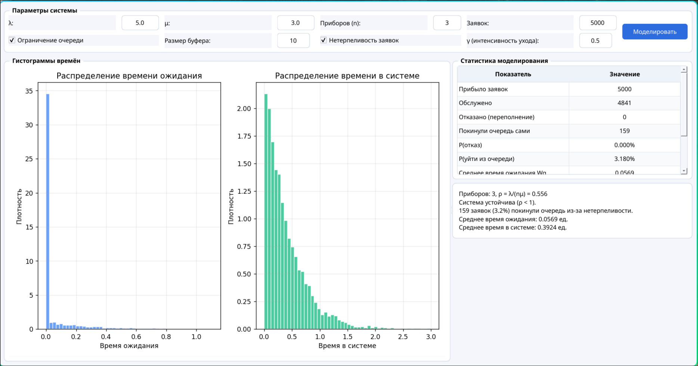

### Система массового обслуживания M/M/n с усложнениями

**Задание:**
- реализовать систему M/M/n с несколькими приборами (ООП);
- добавить два дополнительных правила: **ограничение буфера очереди** и **нетерпеливость заявок**;
- собрать статистику и вывести результаты с подробным логированием.

## 1. Модель

Система **M/M/n** — многоканальная СМО:

- поток заявок пуассоновский с интенсивностью λ;
- время обслуживания ~ Exp(μ), n параллельных приборов;
- очередь FIFO с ограниченным буфером K.

### Усложнения:

**1. Отказы**  
Если все n приборов заняты и в очереди уже K заявок — новая заявка получает отказ и покидает систему.

**2. Нетерпеливость заявок**  
Каждая заявка, вставшая в очередь, имеет случайное время терпения ~ Exp(γ). Если за это время обслуживание не началось — заявка уходит сама.

### Параметры моделирования:

| Параметр | Значение |
|----------|----------|
| λ (интенсивность поступления) | 5.0 |
| μ (интенсивность обслуживания) | 3.0 |
| n (число приборов) | 3 |
| K (размер буфера) | 10 |
| γ (интенсивность нетерпеливости) | 0.5 |
| N (число заявок) | 5000 |

### Предложенная нагрузка:

```
ρ = λ/(n·μ) = 5/(3·3) = 0.556
```

Система устойчива (ρ < 1)

## 2. Архитектура (ООП)

| Класс | Роль |
|-------|------|
| `Client` | заявка: время прихода, терпение, флаги ухода/отказа |
| `Server` | прибор: занят/свободен, текущий клиент |
| `MMnQueue` | симулятор: event-driven на куче событий |
| `EventType` | типы событий: ARRIVAL, DEPARTURE, PATIENCE |

Симулятор работает на основе **дискретно-событийного моделирования** (event-driven): в приоритетной очереди хранятся события, обрабатываются в хронологическом порядке.

## 3. Результаты моделирования



## 4. Вывод

- Система с n=3 приборами и ρ=0.556 устойчива; без ограничений очередь не уходила бы в бесконечность.
- Ограничение буфера K=10 приводит к небольшому числу отказов — вероятность отказа мала при данной нагрузке.
- Нетерпеливость заявок (γ=0.5) дополнительно разгружает очередь: часть заявок покидает систему до начала обслуживания, что снижает среднее время ожидания для остальных.
- Эмпирическое время ожидания и время в системе соответствуют ожидаемому поведению многоканальной СМО с потерями.
